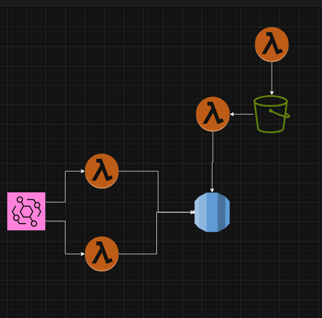

# General Considerations
While not so particulary clearly stated, it is likely that a forecast team would use historical data to make their forecasts.
Storing the full data of 250.000 containers with regular updates does not scale well. There might be systems that handle this kind of large quantities, but the data quanity still keeps adding up.

Let's assume that the location can be generalized to: 
* At Depot X
* In transit
* Out for Delivery

Forecasts are made on 15 minute intervals, so we can assume that the Granularity of this data can also be in the scale of minutes.
Let's assume we store the state every 5 minutes.

We keep track of the last known location of each roll container in something like dynamodb in case the lambda fails. 
We need this to know what location to subtract a stock from.
We can have multiple lambdas process this in parallel by division events based on a hash on the roll container ID. (given ids are randomized)

Rather than keeping track of every individual state of each container, we just keep track of the change in stock in each location (or transit).
This also allows parallel lambdas to write away in parallel, as addition and subtraction are transitive, strictly even serializable no matter what order they go.
We can ofcourse also collect the result of various lambdas if the database can't handle this.

The lambdas could also write away transit times, if that is considered valuable. You would likely want to consider something like sorting averages here too. (Or realistically, if roll containers are transported on the same truck, you probably don't need an transit time for each container.)

I focus on minimizing the data as scaling 250.000 roll containers can quickly become hard to optimize over time. It's hard to fight against a rapidly growing dataset.
This does sacrifice some granularity, but that's something to discuss with the forecast team, very detailed data does not always have actual value.

I don't know how to make this in AWS from the top of my head at all, so I made that for the much simpler Excel stuff. It's rather basic, as data transformation is rather simple.

## Design:

On top, we have a Lambda to retrieve the excel and put in the S3 bucket.
There is a second Lambda to read the excel and put the information into an (rds) database.
This nicely allows us to manually upload an excel if for some reason the infrastructure breaks.

On the left, we have an eventbridge that can distribute events to a set of lambdas based on the hash of the container ID.
It then puts the results in the (rds) database. Additionally, an different solution like DynamoDB could be used for the temporal state of the latest containers.

I do not think RDS is neccesarilly the right option as a data storage option. I am currently not the most up-to-date on the various data storage solutions in AWS to make a good estimation here.
With minimizing the data and RDS could probably handle the load, but if more datapoints are needed anyway different solutions are more suited.
## Scaling:
In my solution scaling is sidestepped by minimizing the data. This does however lose some information, which can be a significant limitation.
The amount of parallel containers that can be handled could be handled by scaling the amount of lambdas that listen to the event bridge, as they are already divided using a hash on the ID.
## Code:
Refer to excel-process-stack.ts for some code example for typescript cdk.

## Points to consider

### Some data-sources are event-driven, others are more stale. How would you approach this in terms of choosing a storage solution.
The stale data-sources are quite small. We are looking at a daily 40 data points and a weekly 40 datapoints.
That adds up a (rough) yearly 16.680 datapoints. This is quite honestly a rather small dataset.
The amount of containers is 15x as large as the yearly datapoints. There is a huge difference of scale.

It would not be unrealistic to simply store the stale datasource in an CSV or Excel, provide that to the Forecast team as is and they can just load that data in-memory.
The data is also rather simple, consisting just of a depot, a date and a value. Any reasonable database could likely serve the needs of a graphQL without any special optimisation. 
For this reason I would mostly focus on the event-drive data and either just put the stale data in the same solution, or create a very simple database off to the side.
I would not provide as an CSV or Excel, purely to allow the forecast to standardize in to using GrapghQL for all data, rather than having to load a file.
If the Forecast team already regularly loads such files anyway, I wouldn't even bother to do so.

### If you considered multiple language choices, we want to know why you think your selection is a good fit (or not) for this solution. We welcome critical thinking and clear communication about your choices regarding programming languages, AWS components, and tooling.
Honestly I simply put Python as the runtime because for just reading the last line of an excel is probably a lot easier in Python with all it's data processing tools. 
Python I am slightly more familiar with to write something ad-hoc. With other code examples any language would be fine for me. 

## Minimum Topics
### A run-down on the design highlighting the different components.
Largely you should separate this in to 3 parts:
1. An S3 bucket with two lambdas to retrieve the Excel and then load the data in the database.
2. An event bridge to get the events into AWS and then lambas to process the data.
3. The Core, a database and the graphQL interface.

### Explain why and how it scales under load, and what ‘bottlenecks’ or limitations still exist.
### We would like to see the code for one of the backend solutions (can be Lambda) in your solution. Use a language that you see fit. Optionally writing the code for this Lambda can be excluded. If this is not prepped in advance, we refer to a code example that we have and ask you during the interview about code improvements.
I do need to see the value of a providing a sample lambda as this is all quite simply data transformation. The real difficulty would be in the data modelling, or integrating with specific systems. 

## Extra Questions
I have elected to broadly state my thoughts on the topics I find most readily possible to answer.
I do have though on the other questions if you want to discuss those. 
### Explain why it is a cost-effective solution.
Honestly the solution is cost-effective purely by reducing the data footprint. 

### How would you approach automated testing to verify acceptance criteria and functionality? If acceptance criteria
   are missing, please use your imagination or email us your questions to get more context. Automated tests are
   important for us. We value TDD/BDD.
This system is implementing rather simple behaviour, and is more aimed at performance optimization and data storage.
So we can keep this quite simple:
   1. Given an example excel, show that the data is loaded correctly in the database.
   2. Given a sample set of events, show that the events are each loaded correctly in the database. 
   3. Given a sample set of events, show that various GraphQL queries give the expected result. 
   4. Given a sample forecast, show that the data is loaded correctly.
Transferring the Excel from one system to our S3 bucket is quite a lot more dependent on infrastructure. 
Rather than testing, I believe it would be wise to put alarms on the success of this process, and intervene when it fails.

As this is likely to be an ever-growing dataset, testing performance on a test-environment would give false confidence.
It is best to continuously monitor performance on production.

While an initial performance test could be considered as an acceptance test, I personally feel this is only useful if ample data is available such that the forecast team can test with realistic queries.

### How would you describe your plan to load test your solution?
To my knowledge most event-based tools should allow multiple consumers to independently consume events. 
The most straight-forward way to test in this case would be to first make sure you can read the normal stream of events without problems.
Secondly you could try to see how quickly it can process also all past data that is still held in the event pipeline.
If that's not available or as a final option, you could record data for a few days and then dump all of that in the event pipeline and see how the system handles that.

As the events are tied to physical objects, I would avoid generating randomized data, as patterns in the data may make the database performance better or worse and are natural to occur.
(Think of timestamps or locations always being the same or always being different, this can impact your database depending on it's setup, and naive randomization might hide these factors.)

### What would you require from your lead engineer or manager to achieve this project?
I would need to have meetings with the forecast team to further refine their requirements. 
The event updates can add up to a lot of data, and if that is unused it would be a waste of resources.
We would also need to understand how they plan to use the graphQL api. 
Spamming a GraphQL API with broad requests every minute would obviously lead to problems no matter how much we optimize it, or more positively, an experienced data team may very well have good advice before we start the project.

I would prefer to have some to check my work and to spar with. (Who is also given appriopiate time to do this.)

I would like to be informed of any future expansion or larger expectation regarding the project if those come up.

Besides this ofcourse the knowledge base to reference existing similar solution or general guidelines in the company. 
